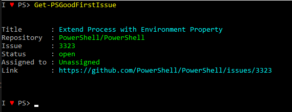
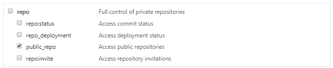

# Get-PSGoodFirstIssue

[](https://ci.appveyor.com/project/tomlarse/get-psgoodfirstissue/branch/master)





## INSTALLATION
```powershell
Install-Module Get-PSGoodFirstIssue -Scope CurrentUser
```

## Rate Limiting
The Github API has rate limiting for fair usage. You can add a PAT token to your account under Developer Settings and provide it with the following permissions to increase your rate limit.



## Get-PSGoodFirstIssue

Gets a random issue from github.com/Powershell/Powershell labeled `Up-for-grabs`

### Syntax
```yaml
Get-PSGoodFirstIssue
 [[-OauthToken] <Object>]
 [[-Repo] <Object>]
 [[-Labels] <Object>]
 [<CommonParameters>]
```

## EXAMPLES

### Example 1
```powershell
PS C:\> Get-PSGoodFirstIssue
```

Gets a random issue labeled `up-for-grabs` from the powershell/powershell repo.

### Example 2
```powershell
PS C:\> Get-PSGoodFirstIssue -Repo "Powershell/vscode-powershell"
```

Gets a random issue labeled `up-for-grabs` from the powershell/vscode-powershell repo.

### Example 3
```powershell
PS C:\> Get-PSGoodFirstIssue -Repo "Powershell/vscode-powershell" -Labels "Issue-bug"
```

Gets a random issue labeled `Issue-bug` from the powershell/vscode-powershell repo.

## Get-PSHacktoberFestIssue

Gets a random issue from any repo with the language PowerShell and the label `Hacktoberfest`

### Syntax
```yaml
Get-PSHacktoberFestIssue
 [[-OauthToken] <Object>]
 [[-Language] <Object>]
 [[-Label] <Object>]
 [[-State] <Object>]
 [<CommonParameters>]
```

## EXAMPLES

### Example 1
```powershell
PS C:\> Get-PSHacktoberFestIssue
```

### Example 2
```powershell
PS C:\> Get-PSHacktoberFestIssue -OauthToken $token
```

Gets a random issue from any repo with the language PowerShell and the label `Hacktoberfest` using oAuth authentication.
